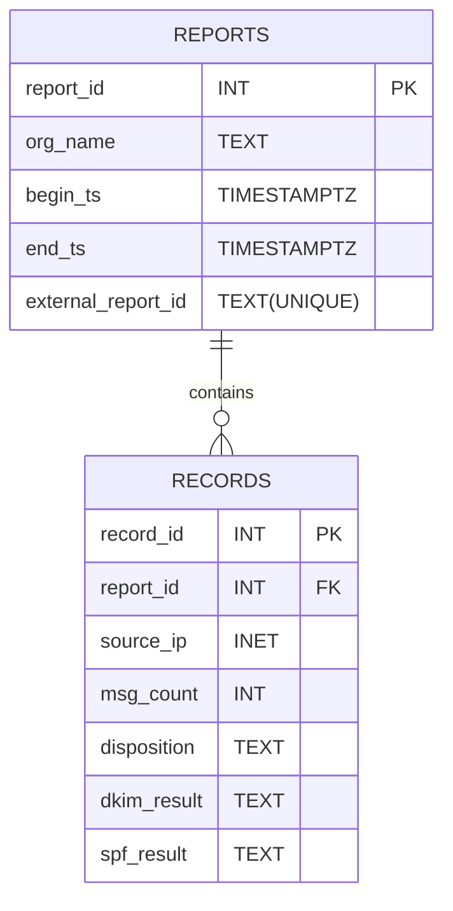

# DMARC Report Analysis Pipeline

A Python ETL pipeline for mass inserting DMARC reports into my local PostgreSQL database for analysis.

## Database Schema

As this is written currently for a personal project, it assumes a specific database schema.

The database is designed to store DMARC authentication reports and their associated authentication records. Each DMARC report corresponds to a single aggregate report published by a reporting organisation (e.g. Microsoft), and contains metadata such as the reporting period and organisation name. Each report contains one or more records, where each record represents a set of messages sharing the same source IP and authentication results.



__Note__: The records table enforces UNIQUE (report_id, source_ip, dkim_result, spf_result, disposition).

## Usage
Install with `pip install -e .` or run directly with `python -m dmarc.cli`.

### Arguments:
+ `ingest <user>@<address>/<name> <path>` | Ingest DMARC XML files from a specified directory.
+ `show <user>@<address>/<name> {reports, records}`   | Show the selected table from the database.
+ `query <user>@<address>/<name> {auth, sources, ips}` | Send the selected query (documented below).
+ `-h`     | Show the main help command, or one for a subcommand.

### Demo Queries:

+ `auth`:

    ```
    SELECT dkim_result, spf_result, SUM(msg_count) AS total_messages
    FROM records
    GROUP BY dkim_result, spf_result
    ORDER BY total_messages DESC;    
    ```
    This collects the total messages with failed authentication for either dkim or spf, and total messages that passed both.
    
+ `sources`:

    ```
    SELECT source_ip, SUM(msg_count) AS failed_messages
    FROM records
    WHERE dkim_result = 'fail' OR spf_result = 'fail'
    GROUP BY source_ip
    ORDER BY failed_messages DESC
    LIMIT 10;
    ```
    This collects the source IPs with failed authentication for either spf or dkim, and the total failed records for each.

+ `ips`:

    ```
    SELECT
        CASE
            WHEN family(source_ip) = 6 THEN 'IPv6'
            ELSE 'IPv4'
        END AS ip_version,
        SUM(msg_count) AS total_messages
    FROM records
    GROUP BY
        CASE
            WHEN family(source_ip) = 6 THEN 'IPv6'
            ELSE 'IPv4'
        END;
    ```
    This collects the type of each source ip (v4 or v6) and the total number of records for each.
