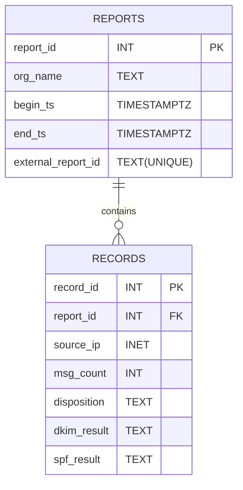

# DMARC Report Analysis Pipeline

A Python ETL pipeline for mass inserting DMARC reports into my local PostgreSQL database for analysis.

## Database Schema

As this is written currently for a personal project, it assumes a specific database schema. The database is designed to store DMARC authentication reports and their associated authentication records. Each DMARC report corresponds to a single aggregate report published by a reporting organisation (e.g. Microsoft), and contains metadata such as the reporting period and organisation name. Each report contains one or more records, where each record represents a set of messages sharing the same source IP and authentication results.

__Note__: The records table enforces UNIQUE (report_id, source_ip, dkim_result, spf_result, disposition).